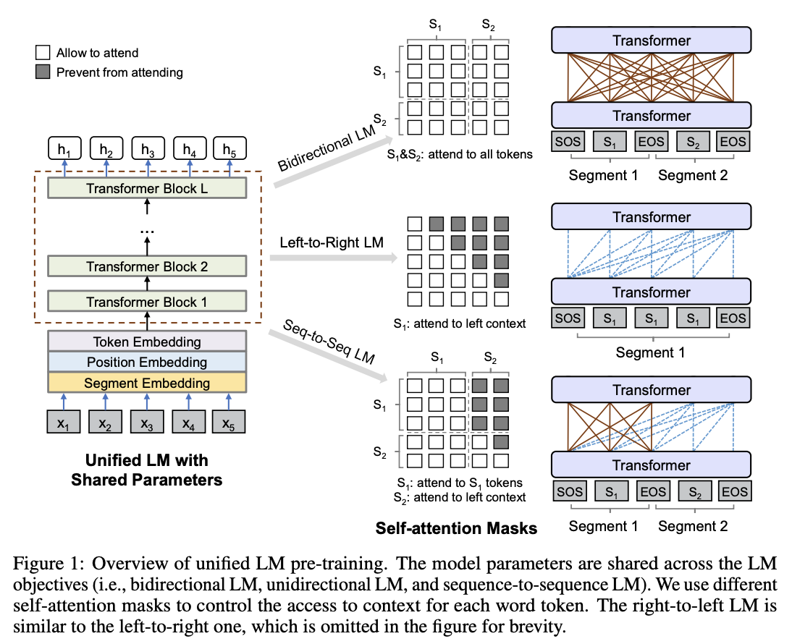

# Lightning Conversation

```
├── src
│   ├── __init__.py
│   ├── data.py
│   ├── inference.py
│   ├── lightning.py
│   ├── model.py
│   └── tokenizer.py
├── Makefile
├── README.md
├── archi.png
├── get_dataset.py
├── requirements.txt
└── train.py
```

## Запуск
- ```make install-requirements``` - установка зависимостей;  
- ```make install-apex``` - установка apex для mixed precision;
- ```make get-amazon``` - скачивание датасета Amazon QA, обучение bpe, сбор токенизированных чанков для тренировки;  
- ```make collect-amazon``` - скачивание датасета OpenSubtitles, обучение bpe, сбор токенизированных чанков для тренировки;
- ```make get-opensubtitles``` - сбор токенизированных чанков Amazon QA для тренировки;
- ```make collect-opensubtitles``` - сбор токенизированных чанков OpenSubtitles для тренировки;
- ```make train-amazon``` - тренировка Amazon QA, требуются подготовленные токенизированные чанки;
- ```make train-opensubtitles``` - тренировка OpenSubtitles, требуются подготовленные токенизированные чанки.

## Данные
[Источник](https://github.com/PolyAI-LDN/conversational-datasets/tree/master/)
### Amazon QA
Вопросы из qa сервиса в 38-ми тематиках. Вопросы с множественными дублировались с разными ответами.  

### OpenSubtitles
Авторами предложено составлять датасет таким образом: каждая следующая реплика является ответом на предыдущую 
и все предыдущие реплики могут использоваться в качестве контекста. В такой постановке задачи модель сходится очень медленно.

### Подготовка данных
```get_dataset.py``` для формирования датасета. Результатом являются:
- bpe модель для youtokentome;
- файл с текстами для обучения bpe;
- словарь bpe;
- директория train с чанками (частями) токенизированного датасета;
- директория validation с чанками (частями) токенизированного датасета.

### Формат данных
Для Amazon QA: ```вопрос <SEP> ответ```  
Для OpenSubtitles: ```контекст <CTX> контекст <CTX> контекст <CTX> реплика <SEP> ответ```  
В Amazon QA два сегмента, а в OpenSubtitles 3 - добавлен сегмент под контекст.
Все сегменты имеют собственные позиционные индексы. Максимальный размер используемого контекста в OpenSubtitles
 задается в сборе датасета через ```get_dataset.py```.

### Dynamic batching
Sequence bucketing обладает большими преимуществами и весомо ускоряет обучение, но
 также имеет недостаток: плохая утилизация видеопамяти в датасетах с разнообразной длиной.
Причиной этого является тот факт, что размер батча мы задаем заранее и аффектимся 
на определенную максимальную длину последовательности в нашем датасете, которая влезает в память,
 мы это делаем, чтобы не получить OOM. Также обычно мы обрубаем длину бОльшую, 
чем некоторая заданная, но все равно в текстах, как правило, остается много батчей с гораздо меньшей длиной. 
В связи с этим мы имеем плохую утилизацию видеопамяти. 
Пример: 33% у GPT ([источник в разделе Compute](https://openai.com/blog/language-unsupervised/)). 
Низкая утилизация говорит о том, что есть видеокарта используется недостаточно оптимально: часть памяти 
на каждой итерации не используется.

В этом репозитории в ```src/data/BatchingStrategy``` реализован dynamic batching: это sequence bucketing, 
где размер батча задается в зависимости от длины примеров внутри батча. То есть эмпирически вычисляем, что 
на видеокарту вмещается 64 примера с длиной в 64 токена, тогда для примеров длиной в 8 токенов мы можем 
увеличить размер батча до 512 примеров (линейная зависимость лучше всего подошла). 
Таким образом мы можем добиться максимальной утилизации.

## Модели

### GPT
Стандартная модель GPT из статьи [Improving Language Understanding
by Generative Pre-Training](https://cdn.openai.com/research-covers/language-unsupervised/language_understanding_paper.pdf).

### Seq2SeqLM
Идея взята из статьи: [Unified Language Model Pre-training for
Natural Language Understanding and Generation](https://arxiv.org/abs/1905.03197)  

А именно 3-й тип маскирования. Предсказываются только токены из S2.  
Данная модель имеет преимущество по сравнению со стандартным трансформером в том,
 что attention взаимодействует со всеми словами из имеющихся в отличие от схемы классического
 трансформера, где в декодере есть отдельно self-attention и отдельно аттеншин для source последовательности.
Разграничиваем информацию о последовательностях за счет сегментов, позиционных токенов для каждого сегмента 
и специальных разделяющих токенов токенов.

Преимущество GPT заключается в том, что есть больше тренировочного сигнала, так как нужно сделать предсказания для всех
токенов, преимуществом же Seq2SeqLM является attention/self-attention между всей последовательностью.
Для того, чтобы использовать преимущества обоих вводится дополнительный шедулер для вероятности того, что текущий батч
будет использован как ```seq2seq``` или ```causal```. С ходом обучения вероятность семплировать ```seq2seq``` батч увеличивается.
Стандартные значения: 0.1 в начале, 0.9 в конце, количество шагов 40000 (дальше остается максимальный параметр).

## Параметры
### ```train.py```
    #train
    --model_type, type=str, default=seq2seq
    --data_source, type=str, default=amazon
    --data_dir, type=str, default=./data/amazon
    --checkpoint_path, type=str, default=./data/amazon/checkpoint
    --project_name, type=str, default=LightningConversation
    --max_norm, type=float, default=2.5
    --distributed_backend, type=str, default=ddp
    --gpus, type=int, default=1 if torch.cuda.is_available() else 0
    --n_grad_accumulate, type=int, default=1
    --batching_type, type=str, default=db
    --num_workers, type=int, default=1
    --batch_size, type=int, default=64
    --max_length, type=int, default=64
    --seed, type=int, default=42
    --seq2seq_min_prob, type=float, default=0.1
    --seq2seq_max_prob, type=float, default=0.9
    --min_training_steps, type=int, default=40000
    
    # model
    --model_dim, type=int, default=768
    --num_heads, type=int, default=12
    --feed_forward_dim, type=int, default=3072
    --num_layers, type=int, default=12
    --response_segment_index, type=int, default=1
    --query_segment_index, type=int, default=2
    --context_segment_index, type=int, default=3
    --weight_tying, action=store_true
    --n_positions, type=int, default=65
    --dropout, type=float, default=0.1
    --initializer_range, type=float, default=0.02

    # loss
    --criterion, type=str, default=label_smoothing
    --smoothing, type=float, default=0.1
    --use_kl, action=store_true

    # optimizers & schedulers
    --optimizer, type=str, default=adam
    --learning_rate, type=float, default=0.001
    --weight_decay, type=float, default=0.
    --momentum, type=float, default=0.9
    --nesterov, action=store_true
    --warmup_steps, type=int, default=4000
    --lr_scheduler, type=str, default=none
    
### ```get_dataset.py```
    --data_source, type=str, required=True
    --data_dir, type=str, required=True
    --sep_token, type=str, default=<SEP>
    --context_token, type=str, default=None
    --max_n_context, type=int, default=3
    --max_train_samples, type=int, default=int(1.e+7)
    --n_bpe_train_samples, type=int, default=int(1.e+7)
    --verbose, action=store_true
    --download, action=store_true
    --train_bpe, action=store_true
    --collect_data, action=store_true
    --chunk_size, type=int, default=int(1.5e+6)
    --min_validation_size, type=int, default=100000
    --validation_prob, type=float, default=0.1
    --min_chars, type=int, default=25
    --max_chars, type=int, default=512
    --min_tokens, type=int, default=10
    --min_tokens_query, type=int, default=3
    --min_tokens_response, type=int, default=3
    --max_tokens, type=int, default=128
    --max_unknowns, type=int, default=3
    --vocab_size, type=int, default=32000
    --bpe_coverage, type=float, default=0.999

## Future Works
- Добавить beam search;
- Обучить модель для оценки MMI, чтобы переранжировать кандидатов;
- Добавить больше лоссов (unlikelihood, plug'n'play);
- Добавить неавторегрессионные модели, например, insertion transformer.
